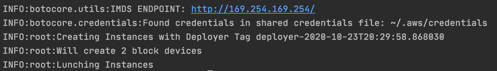

### Description
This submission consists of a deployer script that deploys instances in AWS using a YAML specification.

Implementation Notes:
* Deployer script reuses user scoped credentials stored in `~/.aws/credentials` via boto3
* Default VPC and Security group should allow inbound traffic on port 22 
* `jsonschema` is used to validate the YAML structure

### Steps to Run Locally
#### Install Dependencies
```shell script
user@user-MacBook-Pro fetch % pip3 install -r requirements.txt
user@user-MacBook-Pro fetch % pip3 install awscli
```

#### AWS Configure
```shell script
user@user-MacBook-Pro fetch % aws configure
AWS Access Key ID [****************ABCD]: KEY-HERE
AWS Secret Access Key [****************ABCD]: KEY-HERE
Default region name [us-west-2]:
Default output format [None]:
```

#### Sample Deployment Specification:
```yaml
---
server:
  instance_type: t2.nano
  ami_type: amzn2-ami-hvm
  architecture: x86_64
  root_device_type: ebs
  virtualization_type: hvm
  min_count: 1
  max_count: 1
  volumes:
    - device: /dev/xvda
      size_gb: 40
      type: ext4
      mount: /
    - device: /dev/xvdf
      size_gb: 40
      type: xfs
      mount: /data
  users:
    - login: ec2-user
      ssh_key: # add public key here
    - login: my-test-user
      ssh_key: # add public key here
```

#### Running the Deployer
Usage:
```shell script
user@user-MacBook-Pro fetch % python3 deployer.py
Usage: python3 deployer.py /path/to/file.yaml
```

```shell script
user@user-MacBook-Pro fetch % python3 deployer.py spec.yaml  
INFO:botocore.utils:IMDS ENDPOINT: http://169.254.169.254/
INFO:botocore.credentials:Found credentials in shared credentials file: ~/.aws/credentials
INFO:root:Creating Instances with Deployer Tag deployer-2020-10-23T20:29:58.868030
INFO:root:Will create 2 block devices
INFO:root:Lunching Instances
user@user-MacBook-Pro fetch %
```

### Screenshots
#### Running the Deployer Script Locally:


#### Instance Deployed in AWS Console


#### ec2-user being able to write to /data


#### my-test-user being able to write to /data & see ec2-user's file

